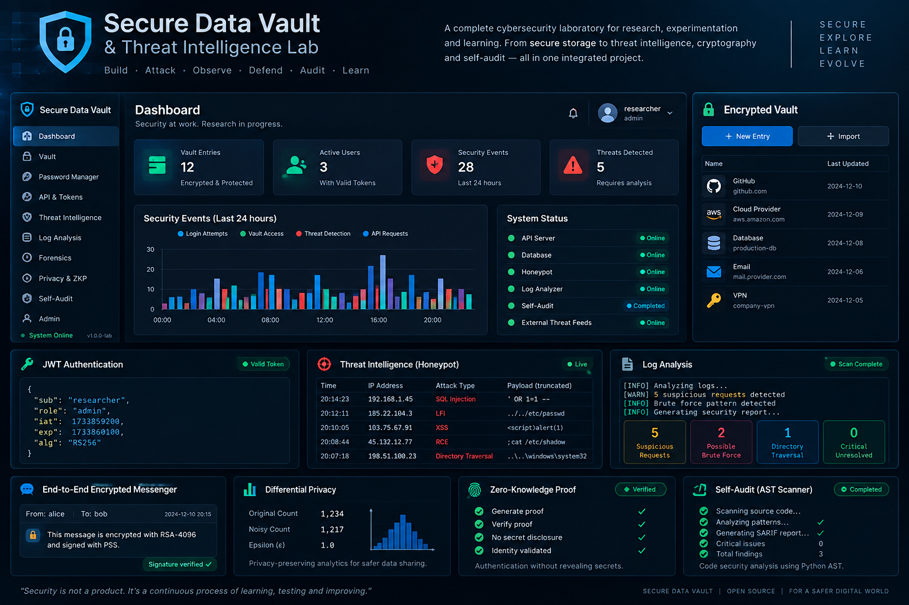

# 🛡️ laboratorio de investigación y experimentación en ingeniería de seguridad

### Laboratorio de Ingeniería de Software Seguro, Criptografía Aplicada, Threat Intelligence y Privacy Engineering

> **Un sistema experimental integrado para estudiar, implementar, atacar, defender, medir y auditar mecanismos modernos de seguridad.**

---





## 🎯 ¿Qué es Secure Data Vault?

**Secure Data Vault & Threat Intelligence Lab** es un laboratorio práctico de investigación y experimentación en **Cybersecurity, Secure Software Engineering, AppSec, DevSecOps, Criptografía Aplicada, Blue Team, DFIR y Privacy Engineering**.

El proyecto parte de una idea sencilla:

> **La seguridad no debería estudiarse solamente leyendo sobre vulnerabilidades o controles. Debería poder implementarse, romperse, observarse, corregirse y verificarse.**

Por eso, el proyecto no está construido como una colección de scripts independientes.

Es un **sistema conectado**, desarrollado progresivamente a lo largo de **10 semanas y 23 ejercicios**, donde cada fase reutiliza componentes construidos anteriormente.

La plataforma comienza con autenticación y almacenamiento seguro, evoluciona hacia un vault cifrado, incorpora seguridad de APIs, desarrolla capacidades de detección y análisis forense, y termina incorporando criptografía avanzada, privacidad y un mecanismo de **self-audit** capaz de analizar el propio código del proyecto.

---

# 🔬 ¿Por qué este proyecto es interesante para investigación?

Secure Data Vault puede utilizarse como un **entorno experimental reproducible** para estudiar la relación entre:

```text
Vulnerabilidad
      ↓
Explotación
      ↓
Mitigación
      ↓
Control de seguridad
      ↓
Observabilidad
      ↓
Detección
      ↓
Forense
      ↓
Privacidad
      ↓
Auditoría
```

Una característica central del proyecto es que algunas vulnerabilidades existen deliberadamente dentro del laboratorio.

Por ejemplo, SQL Injection se presenta mediante una implementación vulnerable y una implementación segura, utilizando el mismo payload de ataque para demostrar experimentalmente la diferencia entre ambas.

Esto permite utilizar el proyecto no solamente para demostrar que un control existe, sino para estudiar **qué cambia cuando ese control es aplicado**.

---

# 🧭 Arquitectura conceptual

```text
┌──────────────────────────────────────────────────────────┐
│              SECURE DATA VAULT LAB                       │
├──────────────────────────────────────────────────────────┤
│  V. ADVANCED CRYPTO / PRIVACY / SELF-AUDIT              │
│     RSA-4096 · E2E · ZKP · Differential Privacy         │
│     AST · SARIF                                          │
├──────────────────────────────────────────────────────────┤
│  IV. THREAT INTELLIGENCE / BLUE TEAM / DFIR             │
│     Honeypot · Log Analysis · PCAP · IoC · YARA         │
├──────────────────────────────────────────────────────────┤
│  III. API SECURITY                                       │
│     JWT · RBAC · Rate Limiting · Password Manager       │
├──────────────────────────────────────────────────────────┤
│  II. SECURE VAULT                                        │
│     AES-256-GCM · PBKDF2 · PII Redaction                │
├──────────────────────────────────────────────────────────┤
│  I. FOUNDATION                                           │
│     Authentication · Database · Validation · SQLi       │
└──────────────────────────────────────────────────────────┘
```

La arquitectura de datos fue diseñada desde el inicio para soportar la evolución del sistema, incluyendo usuarios, entradas del vault, eventos de auditoría, inteligencia de amenazas y registros del honeypot.

---

# 🏗️ Evolución del proyecto

## Fase I — Foundation

### Weeks 1–2

**Estado: completado, probado y documentado.**

La primera fase establece la base de seguridad de la aplicación:

- estructura limpia del proyecto;
- base de datos SQLAlchemy;
- autenticación;
- hashing de contraseñas con bcrypt;
- validación de entradas;
- protección de archivos sensibles;
- demostración y mitigación de SQL Injection.

### Controles principales

**Password hashing**

Las contraseñas nunca se almacenan en texto plano. Se utilizan hashes bcrypt con factor de coste 12.

**Input validation**

Se validan username, email y requisitos de complejidad de contraseña antes de procesar el registro.

**File permission security**

El sistema comprueba archivos sensibles como `.env`, `.pem` y `.key` durante el startup y puede abortar la ejecución si detecta permisos inseguros.

**SQL Injection**

El laboratorio contiene deliberadamente:

```text
app/insecure/sql_injection_demo.py
```

junto con:

```text
app/vault/secure_queries.py
```

La versión segura utiliza consultas parametrizadas, demostrando que el payload de ataque pasa a ser tratado como datos y no como estructura SQL.

---

# 🔐 Fase II — Secure Vault

### Weeks 3–4

**Estado: completado, probado y documentado.**

Esta fase transforma la aplicación en un vault capaz de proteger datos en reposo.

### AES-256-GCM

El sistema utiliza:

```text
AES-256-GCM
```

con un IV aleatorio generado para cada operación de cifrado.

Además de confidencialidad, GCM proporciona autenticación e integridad del ciphertext. Una modificación del contenido provoca un fallo de verificación durante la descifrado.

### Derivación de claves

Las claves del vault no se almacenan directamente.

Se derivan mediante:

```text
PBKDF2
600,000 iterations
```

y existe un cache temporal para reducir derivaciones innecesarias durante una sesión.

### Protección de PII

Los metadatos reciben tratamiento de privacidad antes de ser almacenados.

El sistema identifica y redacta patrones asociados a:

- emails;
- SSN;
- tarjetas de crédito.

Esto aborda un problema importante:

> **Cifrar el contenido de un archivo no significa que sus metadatos estén automáticamente protegidos.**


### Caesar Cipher

También existe un módulo de Caesar Cipher deliberadamente débil.

Su objetivo no es proporcionar seguridad, sino permitir estudiar:

```text
Ciphertext
    ↓
Brute Force
    ↓
Plaintext
```

y contrastar una criptografía educativa trivial con un esquema moderno como AES-256-GCM.

---

# 🔑 Fase III — API Security

### Weeks 5–6

**Estado: completado, probado y documentado.**

La autenticación inicial evoluciona hacia un sistema de gestión de sesiones y autorización.

### JWT con RS256

El sistema utiliza:

- RSA;
- RS256;
- access tokens;
- refresh tokens;
- expiración;
- blacklist;
- refresh-token rotation.

El access token tiene una duración de 15 minutos y el refresh token de 7 días.

La arquitectura asimétrica permite que servicios que únicamente necesitan verificar tokens puedan utilizar la clave pública sin disponer de la capacidad de firmarlos.

### RBAC

La autorización se implementa mediante dependencias de FastAPI:

```text
get_current_user()
        ↓
require_role(...)
        ↓
protected endpoint
```

Se incluyen superficies administrativas como:

```text
/admin/users
/admin/audit-logs
```

### Rate Limiting

La protección contra abuso incorpora:

- Sliding Window;
- Token Bucket;
- exponential backoff.

El control está integrado especialmente alrededor del proceso de autenticación.

### Password Manager

El proyecto incorpora además un password manager CLI que reutiliza el motor criptográfico del vault en lugar de crear una segunda implementación de cifrado.

Incluye operaciones como:

```bash
python -m app.cli.password_manager add <site> --username <user>
python -m app.cli.password_manager get <site>
python -m app.cli.password_manager list
python -m app.cli.password_manager generate
```

También incorpora generación basada en `secrets` y limpieza automática del clipboard.

---

# 🛰️ Fase IV — Threat Intelligence & Blue Team

### Weeks 7–8

**Estado: completado, probado y documentado.**

En esta fase el proyecto deja de limitarse a proteger recursos y comienza a **observar y analizar actividad potencialmente maliciosa**.

## Honeypot

Se incorpora un servidor Flask independiente con una ruta catch-all.

Cada solicitud puede ser:

- capturada;
- clasificada;
- almacenada;
- analizada;
- asociada a un nivel de confianza;
- utilizada para generar alertas.

El clasificador contempla patrones relacionados con:

```text
XSS
LFI
RCE
SQL Injection
```

El evento registrado contiene información como IP, método, path, headers, body, timestamp, tipo de ataque y confidence.

Un detalle importante es que el query string también forma parte del análisis. Esto permite detectar payloads de ataque incluidos en parámetros URL, como LFI y SQLi.

---

# 📊 Mini-SIEM / Log Analysis

La aplicación genera logs estructurados en JSON Lines.

Cada entrada contiene, entre otros:

```text
timestamp
IP
HTTP method
path
status code
user agent
duration
```


El analizador busca indicadores como:

- brute force;
- user agents sospechosos;
- directory traversal;
- spikes de tráfico.

Los resultados se transforman en informes con niveles de severidad.

Esto permite estudiar una pequeña cadena:

```text
Request
   ↓
Structured Log
   ↓
Detection Rule
   ↓
Severity
   ↓
Security Report
```

---

# 🧪 Network & Forensic Analysis

El laboratorio incorpora herramientas para análisis de tráfico y evidencia digital.

### PCAP analysis

Permite trabajar con:

- HTTP;
- DNS;
- TLS SNI;
- detección de port scans;
- suspicious flows.

### Forensic string extraction

Incluye:

- extracción de strings imprimibles;
- filtrado de IoCs;
- correlación;
- generación simplificada de reglas YARA.

---

# 🧬 Fase V — Advanced Cryptography, Privacy & Self-Audit

### Weeks 9–10

**Estado: completado, probado y documentado.**

La última fase reúne varias áreas avanzadas.

## End-to-End Encrypted Messenger

Se implementa mensajería cifrada mediante:

```text
RSA-4096
├── OAEP → encryption
└── PSS  → digital signatures
```

El receptor verifica la firma antes de aceptar el mensaje y utiliza su clave privada para descifrarlo.

---

# 🕵️ Zero-Knowledge Proof

Se implementa un flujo de autenticación basado en:

```text
Schnorr
+
Fiat-Shamir
```

Los tests end-to-end verifican:

- registro;
- generación de prueba;
- verificación;
- rechazo de secretos incorrectos;
- rechazo de identidades no registradas.

El secreto utilizado para generar la prueba no se envía como credencial durante el flujo de verificación.

---

# 🔏 Differential Privacy

El proyecto incorpora un módulo experimental de privacidad diferencial basado en ruido de Laplace.

Incluye:

- generación de informes;
- medición del ruido;
- análisis del parámetro epsilon;
- comprobación de k-anonymity;
- generación de gráficos.

Los tests verifican experimentalmente la relación entre epsilon y magnitud del ruido.

---

# 🔎 Self-Audit Security Scanner

Uno de los componentes más interesantes del laboratorio es su capacidad de **auditar su propio código fuente**.

El scanner utiliza:

```text
Python AST
```

para identificar patrones de código potencialmente peligrosos.

Los findings pueden convertirse a:

```text
SARIF 2.1.0
```

Esto permite integrar los resultados con ecosistemas modernos de code scanning.

Más importante todavía:

> **El scanner se ejecuta sobre el código real del propio proyecto.**

Existe un test específico que exige cero findings `CRITICAL` en el código de producción.

---

# 🧪 Seguridad basada en evidencia

Una de las premisas del proyecto es:

> **Una afirmación de seguridad debe poder verificarse.**

Por eso se utilizan diferentes niveles de evidencia:

```text
Unit Tests
     ↓
Integration Tests
     ↓
End-to-End Tests
     ↓
Manual Attack Validation
     ↓
Static Analysis
     ↓
Dependency Audit
```

Entre las verificaciones documentadas se encuentran:

```bash
bandit -r app/ -x app/insecure
```

Resultado documentado:

```text
No issues identified.
```

Y:

```bash
pip-audit -r requirements.txt
```

Resultado documentado:

```text
No known vulnerabilities found
```


---

# 🐛 Bugs reales encontrados durante el desarrollo

El proyecto documenta también problemas descubiertos durante la ejecución real.

Por ejemplo:

### Differential Privacy

Se detectó el uso de `random` para generar ruido de Laplace.

Fue sustituido por `secrets.SystemRandom()`.

### Password Manager

Se detectó un `except Exception: pass` en el thread de limpieza del clipboard.

Fue reemplazado por logging explícito de la excepción.

Estos cambios son importantes porque muestran una propiedad esencial del laboratorio:

> **La implementación no se considera correcta simplemente porque el código parece correcto.**

Se ejecuta, se observa su comportamiento, se encuentran problemas y se corrigen.

---

# 📚 Organización del conocimiento

El repositorio contiene documentación específica por fase:

```text
docs/
├── week-01-02-foundation.md
├── week-03-04-vault-engine.md
├── week-05-06-api-security.md
├── week-07-08-threat-intelligence.md
└── week-09-10-advanced-crypto.md
```

Cada documento profundiza en:

- fundamentos;
- decisiones de arquitectura;
- ejemplos;
- vulnerabilidades;
- correcciones;
- pruebas;
- limitaciones.

La documentación funciona como complemento técnico del README y permite reconstruir la evolución del sistema.

---

# 🧰 Stack tecnológico

## Backend

- Python 3.12+
- FastAPI
- Pydantic
- Uvicorn
- SQLAlchemy

## Criptografía

- `cryptography`
- `bcrypt`
- PyJWT
- AES-256-GCM
- PBKDF2
- RSA-4096
- OAEP
- PSS
- Schnorr / Fiat-Shamir

## Security & Blue Team

- Flask
- Scapy
- AST
- SARIF
- PCAP analysis
- IoC analysis
- YARA-oriented tooling

## Testing

- Pytest
- HTTPX

## Visualization

- Matplotlib

Las dependencias principales se encuentran declaradas en `requirements.txt`.

---

# 🗂️ Estructura del proyecto

```text
secure-data-vault/
│
├── app/
│   ├── admin/
│   ├── analysis/
│   ├── auth/
│   ├── cli/
│   ├── middleware/
│   ├── privacy/
│   ├── security/
│   ├── vault/
│   ├── zkp/
│   └── insecure/
│
├── docs/
│   ├── week-01-02-foundation.md
│   ├── week-03-04-vault-engine.md
│   ├── week-05-06-api-security.md
│   ├── week-07-08-threat-intelligence.md
│   └── week-09-10-advanced-crypto.md
│
├── tests/
│
├── logs/
│
├── Dockerfile
├── docker-compose.yml
├── requirements.txt
├── ROADMAP.md
├── SECURITY.md
├── README.md
└── .env.example
```

---

# 🛡️ Security Principles

El proyecto mantiene varios principios de seguridad a través de sus diferentes fases:

- no almacenar contraseñas en plaintext;
- utilizar consultas parametrizadas;
- utilizar AES-GCM con IVs aleatorios;
- derivar claves en lugar de almacenarlas;
- minimizar exposición de PII;
- utilizar autenticación basada en tokens firmados;
- aplicar RBAC;
- limitar intentos de autenticación;
- registrar eventos de seguridad;
- aislar el honeypot;
- analizar actividad sospechosa;
- auditar el código;
- documentar las limitaciones.

El roadmap mantiene estos controles como una lista de hardening transversal a las diez semanas.

---

# 🔬 Potencial para investigación

Secure Data Vault puede servir como base para diferentes líneas de investigación o experimentación, por ejemplo:

### Secure Software Engineering

Comparación experimental entre implementaciones vulnerables y endurecidas.

### Application Security

Estudio de controles contra SQL Injection, validación de entrada, autenticación y autorización.

### Cryptography

Experimentación con cifrado simétrico, criptografía asimétrica, firmas digitales y Zero-Knowledge Proofs.

### Privacy Engineering

Evaluación del compromiso entre utilidad y privacidad mediante Differential Privacy.

### Threat Intelligence

Clasificación de payloads, generación de indicadores y análisis de comportamiento.

### Blue Team / DFIR

Construcción de pipelines experimentales desde logs y tráfico de red hasta detección y análisis forense.

### Security Automation

Automatización de análisis mediante AST, SARIF, dependency auditing y self-audit.

### Educación en ciberseguridad

El proyecto puede utilizarse como laboratorio reproducible para estudiar seguridad mediante experimentos controlados.

---

# ⚠️ Limitaciones conocidas

Este proyecto debe entenderse como un **laboratorio de investigación y aprendizaje**, no como un producto listo para producción.

Entre las simplificaciones conocidas se encuentran:

- no existe todavía rotación de las claves de firma RSA utilizadas por JWT;
- el mecanismo de revocación de tokens no está diseñado para despliegues distribuidos;
- el rate limiting está principalmente conectado al flujo de login;
- la persistencia utiliza `Base.metadata.create_all()` en lugar de un sistema de migraciones como Alembic;
- el clasificador del honeypot utiliza patrones y no machine learning;
- el messenger E2E utiliza claves de firma de larga duración;
- el módulo ZKP utiliza parámetros de tamaño reducido, adecuados para el laboratorio pero no para seguridad criptográfica de producción;
- Docker ha sido revisado y validado estructuralmente, pero requiere validación mediante un Docker daemon real antes de considerarse verificado operacionalmente.

Estas limitaciones no se ocultan deliberadamente: forman parte de la documentación del proyecto y permiten distinguir entre **prototipo experimental, laboratorio educativo y sistema de producción**.

---

# 🚀 Estado actual

| Área | Estado |
|---|:---:|
| Secure Coding | ✅ |
| Authentication | ✅ |
| SQL Injection Lab | ✅ |
| Password Hashing | ✅ |
| Input Validation | ✅ |
| File Permission Security | ✅ |
| Encrypted Vault | ✅ |
| AES-256-GCM | ✅ |
| PBKDF2 | ✅ |
| PII Redaction | ✅ |
| JWT / RS256 | ✅ |
| Refresh Token Rotation | ✅ |
| RBAC | ✅ |
| Rate Limiting | ✅ |
| Password Manager | ✅ |
| Honeypot | ✅ |
| Threat Classification | ✅ |
| Log Analysis | ✅ |
| PCAP Analysis | ✅ |
| Forensics / IoCs | ✅ |
| YARA-oriented analysis | ✅ |
| E2E Encryption | ✅ |
| Zero-Knowledge Proof | ✅ |
| Differential Privacy | ✅ |
| AST Self-Audit | ✅ |
| SARIF | ✅ |
| Bandit Audit | ✅ |
| pip-audit | ✅ |
| Docker Runtime Verification | (Hacer en su propio ambiente)|

---

# 🧠 Filosofía del laboratorio

Secure Data Vault intenta representar una forma diferente de aprender seguridad:

```text
              ┌───────────────┐
              │    BUILD      │
              └───────┬───────┘
                      ↓
              ┌───────────────┐
              │    ATTACK     │
              └───────┬───────┘
                      ↓
              ┌───────────────┐
              │    OBSERVE    │
              └───────┬───────┘
                      ↓
              ┌───────────────┐
              │    DEFEND     │
              └───────┬───────┘
                      ↓
              ┌───────────────┐
              │     TEST      │
              └───────┬───────┘
                      ↓
              ┌───────────────┐
              │     AUDIT     │
              └───────┬───────┘
                      ↓
              ┌───────────────┐
              │    DOCUMENT   │
              └───────────────┘
```

El objetivo final no es solamente producir código que "parezca seguro".

Es construir un entorno donde las decisiones de seguridad puedan ser:

**implementadas → experimentadas → observadas → verificadas → discutidas.**

---

# 📖 Documentación

Consulta el directorio [`docs/`](./docs/) para los walkthroughs detallados de cada fase.

El archivo [`ROADMAP.md`](./ROADMAP.md) presenta la evolución completa de las 10 semanas y los 23 ejercicios.

El archivo [`SECURITY.md`](./SECURITY.md) contiene el informe de seguridad y las limitaciones conocidas.

---

# ⚠️ Disclaimer

Este repositorio ha sido creado con fines de **investigación, educación, experimentación y desarrollo de software seguro**.

Las implementaciones criptográficas, mecanismos de detección y configuraciones presentes en el laboratorio no deben interpretarse automáticamente como equivalentes a una solución de producción.

Las limitaciones documentadas deben revisarse antes de reutilizar cualquier componente en un entorno real.

---

# 📌 Project Status

**Secure Data Vault & Threat Intelligence Lab**

> **Experimental security platform — implemented, tested, documented and designed for reproducible security research and learning.**